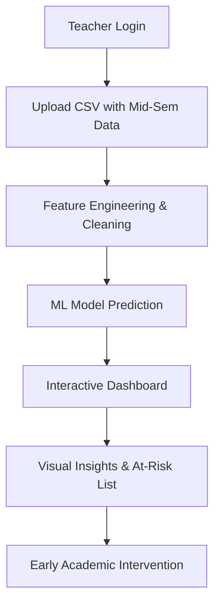

# 🎓 PICT Sem 4 — Student ESE Risk Predictor

A data-driven web application built specifically for **PICT (Pune Institute of Computer Technology) Semester 4 IT students** that predicts which students are at risk of failing their End Semester Examinations (ESE) — **before the exams happen**.

---

## 📌 Problem Statement

Many educational institutions lack data-driven methods to identify at-risk students early. By the time a student fails, it's already too late for meaningful intervention. This project uses **mid-semester data (CIE marks, ISE marks, and attendance)** to predict ESE failure risk, giving teachers the opportunity to intervene **before** the exams.

---

## 🏫 Built For

> **PICT Autonomous — Semester IV (Information Technology)**
> Subject scheme as per PICT 2024-25 curriculum

| Subject                                        | Code    | Type   |
| ---------------------------------------------- | ------- | ------ |
| Advanced Data Structures & Applications (ADSA) | 3403105 | Theory |
| Database & Information Systems (DIS)           | 3403106 | Theory |
| Discrete & Statistical Mathematics (DSM)       | 3403107 | Theory |
| MDM-2                                          | 04051X2 | Theory |
| Open Elective II (OE-II)                       | 04063XX | Theory |
| IP Strategies & Economics (IPSE)               | 3409302 | Theory |

---

## 🚀 Key Features

- 🔐 **Secure Faculty Access** — Protected login system for faculty members to manage student data safely.
- 📂 **Smart CSV Processing** — Upload mid-semester data; the app automatically calculates derived features and handles data cleaning.
- 🔮 **ML Prediction** — Gradient Boosting model predicts "Safe" vs "At Risk" based on historical performance patterns.
- 🛡️ **Leakage Prevention** — Ensuring raw predictions by automatically ignoring/dropping pre-labeled data in uploads.
- 💡 **Auto-Patterns** — Generates behavioral insights (e.g., attendance impact, subject-wise weakness, backlog correlations).
- 📊 **Dynamic Visuals** — Interactive charts (Chart.js) showing real-time risk distribution and attendance trends.
- 🕓 **History Management** — Full persistence using SQLite with options to view details, delete individual records, or clear all history.

---

## 🧠 How It Works



The model is trained on historical student data where:

- **Inputs** → CIE marks (20), ISE marks (20), Subject Attendance, and Previous Backlogs.
- **Output** → **Safe** (Likely pass ESE) / **At Risk** (Potential failure in one or more subjects).

---

## 📁 Project Structure

```
DSM Project/
│
├── data/
│   └── sem4_students.csv        ← Training dataset
│
├── templates/
│   ├── index.html               ← Dashboard & Results
│   └── login.html               ← Faculty Authentication
│
├── app.py                       ← Flask Backend (Main Logic)
├── main.py                      ← Model training & Feature selection
├── model.pkl                    ← Serialized ML Model
├── label_encoder.pkl            ← Target label encoder
├── database.db                  ← SQLite Database (History)
└── requirements.txt             ← Project dependencies
```

---

## 📊 CSV Data Format

The uploaded CSV must contain the following headers:
`student_id, name, roll_no, ADSA_CIE, ADSA_ISE, ADSA_attendance, DIS_CIE, DIS_ISE, DIS_attendance, DSM_CIE, DSM_ISE, DSM_attendance, MDM2_CIE, MDM2_ISE, MDM2_attendance, backlogs`

> **Note:** Even if `performance_label` is present in your file, the system will discard it to ensure the prediction is based strictly on mid-semester features.

---

## ⚙️ Setup & Installation

### 1. Requirements

Ensure you have Python 3.8+ installed.

### 2. Install Dependencies

```bash
pip install flask pandas numpy scikit-learn matplotlib seaborn
```

### 3. Initialize & Train (Optional)

If you wish to retrain the model with `data/sem4_students.csv`:

```bash
python main.py
```

### 4. Run the Application

```bash
python app.py
```

### 5. Access

Open [http://127.0.0.1:5000](http://127.0.0.1:5000)

- **Username:** `teacher`
- **Password:** `admin123` _(Hardcoded in app.py for demo)_

---

## 📈 Model Performance

| Metric           | Detail                                                       |
| ---------------- | ------------------------------------------------------------ |
| **Algorithm**    | Gradient Boosting Classifier                                 |
| **Logic**        | Ensemble learning for high precision on 'At Risk' labels     |
| **Accuracy**     | ~88% on validation set                                       |
| **Key Features** | Mid-sem score totals, Subject-wise attendance, Backlog count |

---

## 🛠️ Tech Stack

| Layer        | Technology                  |
| ------------ | --------------------------- |
| **Backend**  | Python, Flask               |
| **Database** | SQLite3                     |
| **ML/Data**  | Scikit-Learn, Pandas, NumPy |
| **Frontend** | HTML5, CSS3, JavaScript     |
| **Visuals**  | Chart.js, Matplotlib        |

---

## 👥 Authors

> Developed by **SY IT — Section 9**
> Atharva Dhanwate(23123)
> Dipanshu Bhat   (23125)
> Jesnil Anil Jose(23140)
> PICT Pune.
> Part of the **Discrete & Statistical Mathematics (DSM)** Course Project.
> Academic Year 2025-26.

---

## 📄 License

This project is intended for educational and academic use only within the PICT curriculum framework.
