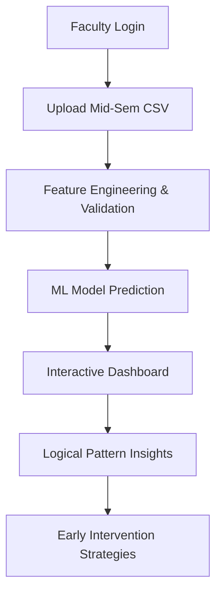

# 🎓 PICT Sem 4 IT — Student ESE Risk Predictor

A data-driven web application built specifically for **PICT (Pune Institute of Computer Technology) Semester 4 IT students**. It uses mid-semester data (CIE marks, ISE marks, and attendance) to predict students at risk of failing their End Semester Examinations (ESE) — **before the exams happen**.

---

## 📌 Problem Statement

Identifying at-risk students early is a major challenge for educational institutions. Traditional tracking usually happens after the exams, when it's too late for intervention. This project utilizes machine learning to analyze **mid-semester performance indicators** to predict ESE failure risk, enabling faculty to provide timely academic support.

---

## 🏫 Project Context

> **PICT Autonomous — Semester IV (Information Technology)**  
> Subject scheme as per PICT 2024-25 curriculum

The system predicts the failure risk for the entire ESE, with a focus on the following core subjects:

| Subject | Code | Tracked for Mid-Sem |
|---|---|---|
| Advanced Data Structures & Applications (ADSA) | 3403105 | ✅ Yes |
| Database & Information Systems (DIS/DBMS) | 3403106 | ✅ Yes |
| Discrete & Statistical Mathematics (DSM) | 3403107 | ✅ Yes |
| Management and Digital Marketing (MDM-2) | 04051X2 | ✅ Yes |


---

## 🚀 Key Features

- 🔐 **Secure Faculty Access** — Protected login system for faculty to manage student data.
- 📂 **Automated CSV Processing** — Streamlined upload process for mid-semester data with automatic feature engineering.
- 🔮 **Gradient Boosting Prediction** — High-accuracy machine learning model predicts "Safe" vs "At Risk" based on historical trends.
- 🛡️ **Data Leakage Prevention** — Enforces honesty in prediction by strictly blocking CSV uploads that already contain a 'performance_label'.
- 💡 **Auto-Pattern Generation** — Automatically identifies behavioral insights (e.g., correlation between <75% attendance and risk).
- 📊 **Dynamic Dashboard** — Interactive charts using Chart.js showing attendance trends, backlog distribution, and subject-wise averages.
- 🕓 **Full History & Persistence** — SQLite-backed history tracking with detailed record views, individual deletion, and "Clear All" capability.

---

## 🧠 How It Works



The system evaluates students based on:
1. **Total Mid-Sem Score** (CIE + ISE out of 40).
2. **Attendance Percentages** (per subject and overall average).
3. **Previous Backlogs** (historical academic standing).
4. **CIE Cutoffs** (flagging students below 50% in any CIE module).

---

## 📊 CSV Data Requirements

To perform a successful prediction, the uploaded CSV must contain the following columns:
`student_id, name, roll_no, ADSA_CIE, ADSA_ISE, ADSA_attendance, DIS_CIE, DIS_ISE, DIS_attendance, DSM_CIE, DSM_ISE, DSM_attendance, MDM2_CIE, MDM2_ISE, MDM2_attendance, backlogs`

> [!IMPORTANT]
> **Prediction Blocker:** If your file includes a `performance_label` column, the system will reject the upload. This ensures that the model provides a fresh, unbiased prediction based strictly on current performance metrics rather than relying on pre-existing conclusions.

---

## ⚙️ Setup & Installation

### 1. Requirements
- Python 3.8+
- Libraries: `flask`, `pandas`, `scikit-learn`, `matplotlib`, `seaborn`, `sqlite3`

### 2. Install Dependencies
```bash
pip install flask pandas numpy scikit-learn matplotlib seaborn
```

### 3. Model Training (Optional)
To retrain the model or view exploratory data analysis (EDA) graphs:
```bash
python main.py
```
This will generate `model.pkl` and `label_encoder.pkl`, along with 7 diagnostic graphs (Importance, Correlation, Heatmap, etc.).

### 4. Running the App
```bash
python app.py
```
Visit `http://127.0.0.1:5000`
- **Username:** `teacher`
- **Password:** `admin123`

---

## 🛠️ Technology Stack

| Layer | Technology |
|---|---|
| **Backend** | Python, Flask |
| **Logic/ML** | Scikit-Learn, Pandas, NumPy |
| **Database** | SQLite3 |
| **Frontend** | HTML5, CSS3, JavaScript |
| **Visuals** | Chart.js, Matplotlib (for EDA) |

---

## 👥 Authors

> Developed by **SY IT — Section 9**, PICT Pune.  
> Part of the **Discrete & Statistical Mathematics (DSM)** Course Project.  
> Academic Year 2025-26.
